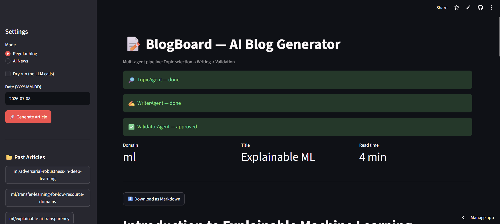
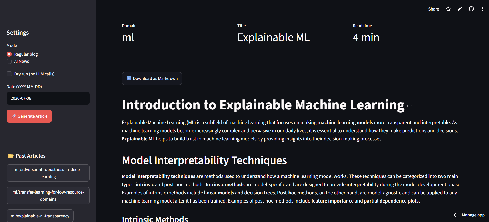
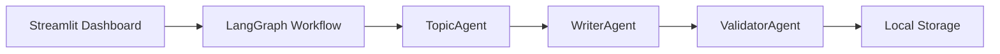

<div align="center">

# BlogBoard — Autonomous AI Blog Generator

**A multi-agent pipeline that autonomously picks a topic, writes a full technical blog post, validates it, and saves it — no human writing required.**

[](LICENSE)
[](https://github.com/shruthimattam/blog-generation-using-agentic-ai/stargazers)
[](https://github.com/shruthimattam/blog-generation-using-agentic-ai/issues)

[Report Bug](https://github.com/shruthimattam/blog-generation-using-agentic-ai/issues) &nbsp;|&nbsp; [Request Feature](https://github.com/shruthimattam/blog-generation-using-agentic-ai/issues)

</div>

<br>

<div align="center">
  
  <p><em>The Streamlit dashboard tracking a live run — TopicAgent, WriterAgent, and ValidatorAgent all completed.</em></p>
</div>

---

## Table of Contents

- [About The Project](#about-the-project)
- [Architecture](#architecture)
- [Tech Stack](#tech-stack)
- [Getting Started](#getting-started)
- [API Key Setup](#api-key-setup)
- [Acknowledgements](#acknowledgements)
- [License](#license)

---

## About The Project

BlogBoard is an end-to-end, autonomous blogging pipeline. It independently picks a topic, writes a full technical article, validates the draft for quality, and saves it — with zero manual writing.

Powered by **LangGraph** for stateful multi-agent orchestration and **Groq** for blazing-fast LLM inference, it ensures high-quality, well-structured articles are generated hands-free. A **Streamlit dashboard** is included to trigger runs and monitor each agent's progress live.

**Core capabilities:**

- Fully autonomous content pipeline — topic selection, writing, and validation handled by dedicated agents
- Blazing-fast LLM inference via Groq
- Stateful, multi-agent workflow orchestration with LangGraph
- Runs entirely offline — local filesystem storage, zero cloud setup required
- Live-updating Streamlit dashboard for manual triggers and run monitoring

<br>

<div align="center">
  
  <p><em>A completed article — "Explainable ML" — generated and validated automatically, ready to download as Markdown.</em></p>
</div>

---

## Architecture



1. A run is triggered manually via the **Streamlit dashboard**.
2. **LangGraph** coordinates the run as a stateful graph across three agents:
   - **TopicAgent** — selects the article topic and domain
   - **WriterAgent** — drafts the full article
   - **ValidatorAgent** — reviews and approves the draft
3. **Groq** powers inference at every agent step.
4. The approved article is saved to the local filesystem, along with metadata.

---

## Tech Stack

| Layer          | Technology |
|----------------|------------|
| Orchestration  | [LangGraph](https://github.com/langchain-ai/langgraph) |
| LLM Inference  | [Groq](https://groq.com/) |
| Dashboard      | [Streamlit](https://streamlit.io/) |
| Backend        | Python 3.12+ |
| Env Management | [uv](https://github.com/astral-sh/uv) |

---

## Getting Started

### 1. Clone the repository
```bash
git clone https://github.com/shruthimattam/blog-generation-using-agentic-ai.git
cd blog-generation-using-agentic-ai
```

### 2. Create a virtual environment
```bash
uv venv
```

### 3. Activate the virtual environment
```bash
# Windows
.venv\Scripts\activate

# Linux / macOS
source .venv/bin/activate
```

### 4. Install dependencies
```bash
uv sync
```

### 5. Configure your API key
See [API Key Setup](#api-key-setup) below.

### 6. Run the pipeline
```bash
python blogboard/run.py
```
Generates a new blog post, saved under `local_storage/blogs/`.

### 7. Launch the dashboard
```bash
streamlit run app_streamlit.py
```
Open the URL shown in your terminal to trigger generation and browse posts.

---

## API Key Setup

BlogBoard uses **Groq** for LLM inference.

1. Visit the [Groq Console](https://console.groq.com/) and create an account to obtain your API key.
2. Create a `.env` file in the project root.
3. Add your key:

```dotenv
LLM__API_KEY=your_api_key_here
```

Keep your API key confidential — never commit it to version control.

---

## Acknowledgements

Original multi-agent architecture and prompt design by [KalyanM45](https://github.com/KalyanM45/Multi-Agentic-Blog-Generation). This version focuses on making the project runnable without cloud dependencies and adding a browser-based dashboard.

---

## License

Licensed under the [MIT License](https://opensource.org/licenses/MIT).
